 جا استادی !

آیا از سردرگمی‌ در پرشیس خسته شدید؟ نمی‌دونید کدوم استاد چه درسی رو داره؟ برنامه‌های کلاس‌هات رو اول هر ترم مدام یادت می‌ره؟ یا شایدم توی انتخاب واحد مشکل داری!؟ جا استادی اومده تا این مشکلات رو سروسامون بده

## چرا جا استادی ؟

وبسایت پرشیس پر از نقص٬ کمبود و کاستی هست٬ بیشتر از اینکه به کاربرها کمک کنه اونارو گیج می‌کنه گذشته از اون  بخش‌های پرشیس هیج نظم و ساماندهی درستی نداره.  هدف ما؟ ‌یه سامانه منظم مدرن و همه جانبه که بتونه نیازهای کاربرهارو رفع کنه

## چه قابلیت‌هایی داره ؟

-  مشاهده و مدیریت دروس ارائه شده
- اطلاعات مربوط به اساتید
-  اطلاعات دپارتمان‌های علمی مختلف  
- برنامه هفتگی

## چطور باهاش کار کنم ؟
خیلی ساده بعد از اجرای قدم‌های مربوط توی بخش چطور پروژه رو اجرا کنم٬ با استفاده از بخش بندی‌های مربوط توی صفحه‌ای که توی مرورگر شما باز می‌شه می‌تونید به بخش‌هایی که در بخش قبل اشاره شد دسترسی داشته باشید٬ با کلیک روی هر بخش می‌تونید اطلاعات اون بخش رو ببینید 

## چه چیزی‌هایی در آینده بهش اضافه می‌شه ؟

- اطلاعات تماسی برای مسئولین مختلف 
- اطلاعات ارتباطی با استاید 
- و ... 


----------

## چطور در فرایند توسعه شرکت کنم ؟

ما از همکاری همه‌ی علاقه‌مندان استقبال می‌کنیم 🚀  
برای مشارکت در پروژه مراحل زیر رو انجام بده:

1. کن Fork این مخزن رو .
2. جدید برای تغییراتت بساز  Branch :
   ```bash
   git checkout -b feature/my-new-feature

3. تغییراتت رو اعمال و Commit کن:
    
    ```bash
    git commit -m "اضافه کردن قابلیت X"
    
    ```
    
4.  Branch رو Push کن:
    
    ```bash
    git push origin feature/my-new-feature
    
    ```
    
5.  یک Pull Request باز کن تا تغییراتت بررسی بشه.
    


## چطور پروژه رو اجرا کنم؟
<details>
   <summary>⒈ اجرای پروژه به صورت کلاسیک </summary>

این پروژه شامل سه بخشه:  **Front (React + TS)**،  **Back (Go API)**  و  **Scraper (Go)**.  
در ادامه روش اجرای هر بخش رو می‌بینی:

----------

### 🔎 Scraper (Go)

```bash
cd Scraper
go mod tidy
go run main.go

```

### ⚙️ Back (Go Fiber API)

```bash
cd Back
go mod tidy
go run main.go

```

### 🖥️ Front (React + TS)

```bash
cd Front
npm install
npm run dev

```

سپس مرورگر رو باز کن و به آدرس  [http://localhost:5173](http://localhost:5173/)  برو.


به طور پیش‌فرض API روی پورت  `:3000`  در دسترس خواهد بود.

 </details>
 <details>
   <summary>⒉ اجرای پروژه با داکر</summary>

   1. نصب Docker (در صورت نبود) 
   
   ```shell
   curl -fsSL https://get.docker.com | sh
   ```
   
   2. کلون کردن پروژه
   
   ```shell
   git clone https://github.com/AlirezaSaadatmand/Ja-Ostadi.git
   cd Ja-Ostadi
   ```
   3. ساخت شبکه Docker   
   ```shell
   docker network create \
      --driver=bridge \
      --subnet=192.168.25.0/24 \
      --ip-range=192.168.25.0/24 \
      --gateway=192.168.25.254 \
      Ja_Ostadi_network
   ```
   4. اجرای پروژه
   ```shell
   docker compose up -d --build
   
   ```
   
   </details>


## نکات مهم

-   مطمئن شو که فایل  `.env`  رو در مسیر  **Back**  ساخته باشی و تنظیمات دیتابیس رو درست وارد کرده باشی.
    
-   قبل از اجرای Back و Scraper حتماً MySQL رو اجرا و دیتابیس موردنیاز رو ساخته باشی.
        


# ساختار پروژه
***این بخش به زودی آپدیت خواهد شد***

### این پروژه شامل سه بخش اصلی هست :

 1. **Scraper** -> برای گرفتن اطلاعات کاربر -> _GO_   
 2. **Back** -> api  برای مدیریت اطلاعات دریافتی -> _GO_  
 3.  **Front** -> UI مربوط به پروژه -> _React_+_Ts_

##  از فرایند برنامه کلاسی UML نمودار

```mermaid
sequenceDiagram
Front ->> Back: برنامه کلاسی کاربر
Back ->> Scraper:  درخواست اطلاعات
Scraper -->> Back: json خواندن از فایل 
Back -->> Front: پاسخ نهایی

```



